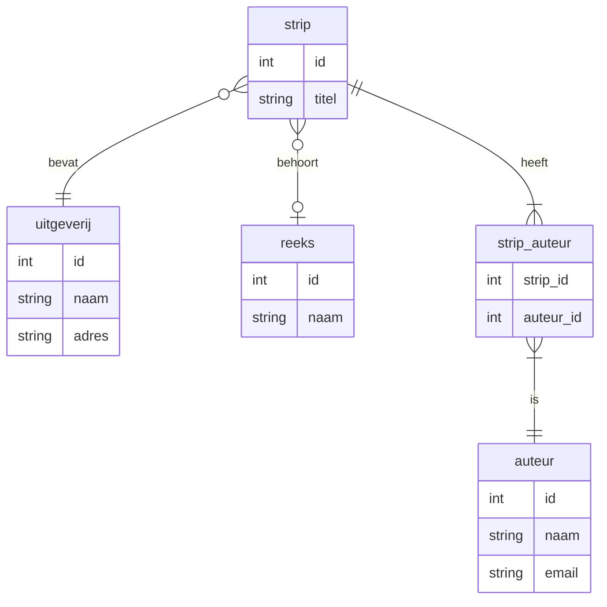

## ER-Diagram

```mermaid
erDiagram
   strip {
    int id
    string titel
   }
   auteur {
    int id
    string naam
    string email
   }
   uitgeverij {
    int id
    string naam
    string adres
   }
   reeks {
    int id
    string naam
   }
   strip_auteur {
    int strip_id
    int auteur_id
   }

   strip }o--|| uitgeverij : bevat
   strip ||--|{ strip_auteur : heeft
   strip_auteur }|--|| auteur : is
   strip }o--o| reeks : behoort
```
